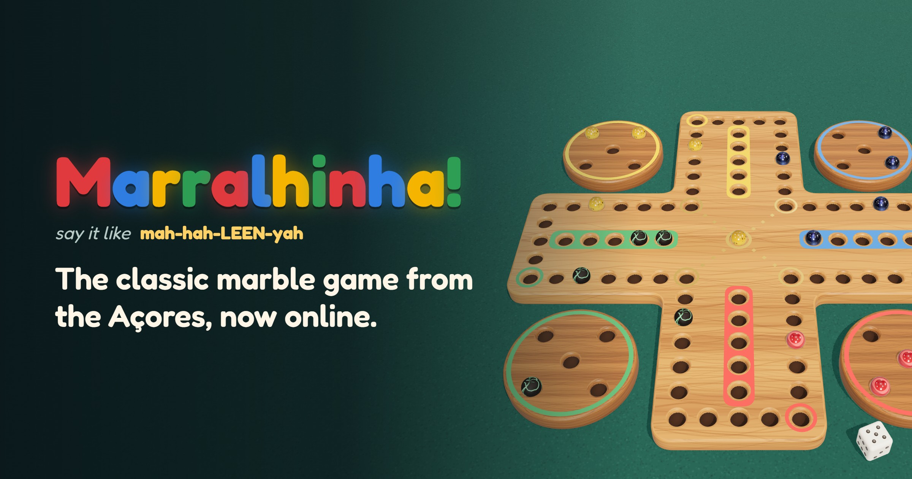
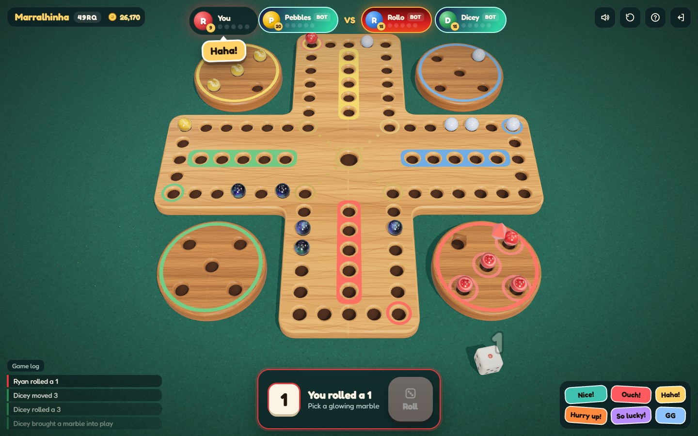
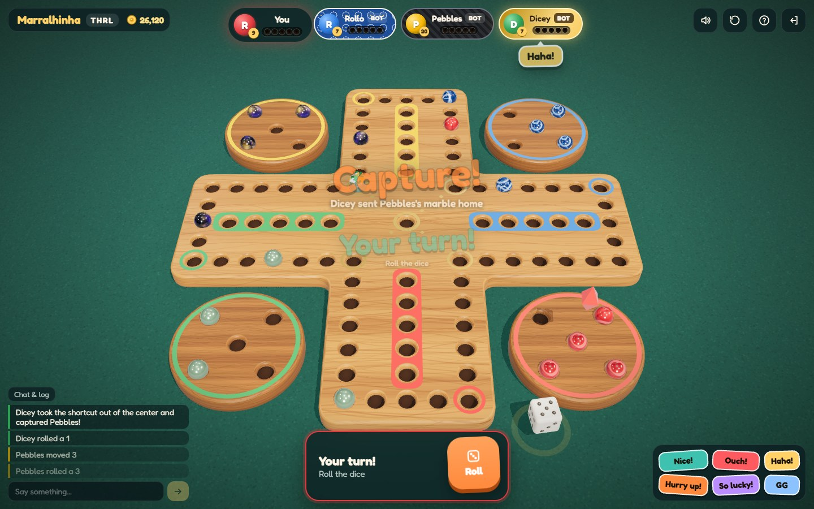
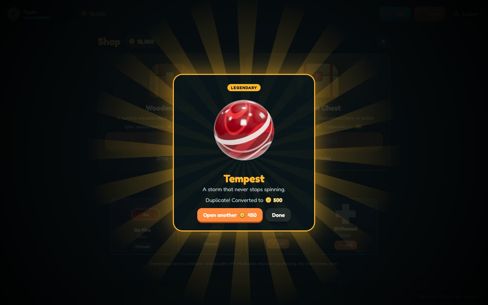
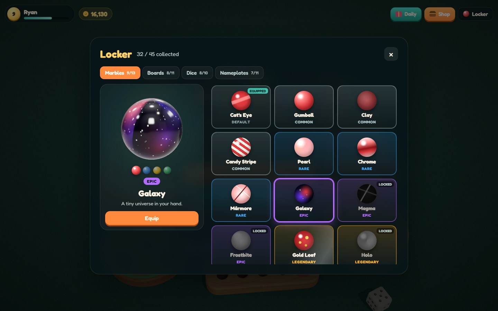
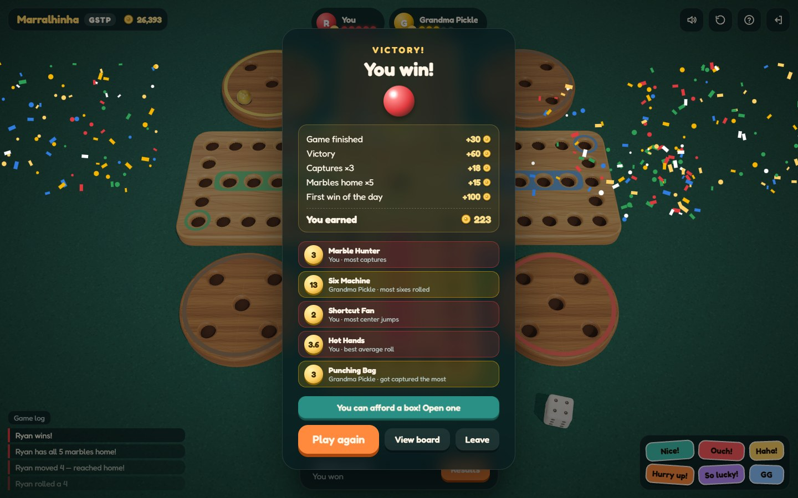
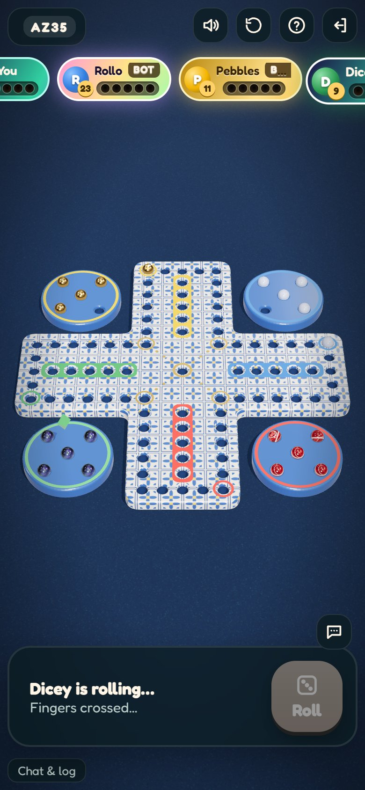

# Marralhinha Online

**Play now at [marralhinha.app](https://marralhinha.app), or inside Discord as a voice channel Activity.**

Marralhinha (say it like "mah-hah-LEEN-yah") is the traditional marble board game from Terceira, in the Azores. Race your marbles around the board, capture your opponents', and take the shortcut through the center if you dare. This is it online: 2–4 players, with friends or bots, on desktop or mobile.
Made by [Ryan Polasky](https://github.com/ryanpolasky).

| Gameplay | Captures |
| --- | --- |
|  |  |
| **Lootboxes** | **Locker** |
|  |  |
| **Victory + rewards** | **Mobile** |
|  |  |

## How to play

- Race all your marbles around the board and into your colored home column. First player with every marble home wins.
- Roll a 6 and you roll again. Anything else, and the turn passes.
- Land on an opponent's marble to capture it and send it back to their dish.
- On any brass corner except the last one before your home, a 1 or 6 jumps you into the center. From the center, another 1 or 6 drops you on that last corner, right by your home. The shortcut is worth chasing.
- In the home column you need the exact roll to move: no overshooting, and no jumping your own marbles.

**Controls:** Space rolls, Tab then Enter picks a move. Drag to spin the board, scroll to zoom, and ping a spot with H (G warns teammates) or right-click / long-press. The full rules live under the ? button in game.

## Modes

- **Classic**: five marbles on the full board.
- **Blitz**: three marbles on a smaller board, roughly a third of the time.
- **2v2 teams**: with four players the host can team you up. Partners sit opposite each other, can't capture each other, and once your own marbles are home you move your partner's.

Short on humans? Bots fill empty seats, and they take over for players who drop (you get one reconnect grace period). Need a break mid-game? Hit the coffee cup and a bot plays your turns while you're away.

## Progression

Everyone gets a guest account instantly. Play games to earn **Marbucks**, then spend them on chests and daily featured cosmetics: marbles, boards, dice and nameplates. Profiles track match history, player cards and leaderboards, and in-game chat supports team messages and optional event logs.

Everything is cosmetic. Marbucks can't be bought, so nothing purchasable changes the game. The optional one-time **Supporter Pack** helps fund the server and grants a badge plus four exclusive cosmetics. The seasonal **Halloween Pack** works the same way, but it is only sold during October. Link your Discord account to keep progress across devices and to launch the game as an Activity inside voice channels, where everyone in the channel lands at the same table automatically.

## Community

- Support Discord: [discord.gg/T4Efqprrd8](https://discord.gg/T4Efqprrd8)
- [Terms of Service](TERMS.md) · [Privacy Policy](PRIVACY.md)
